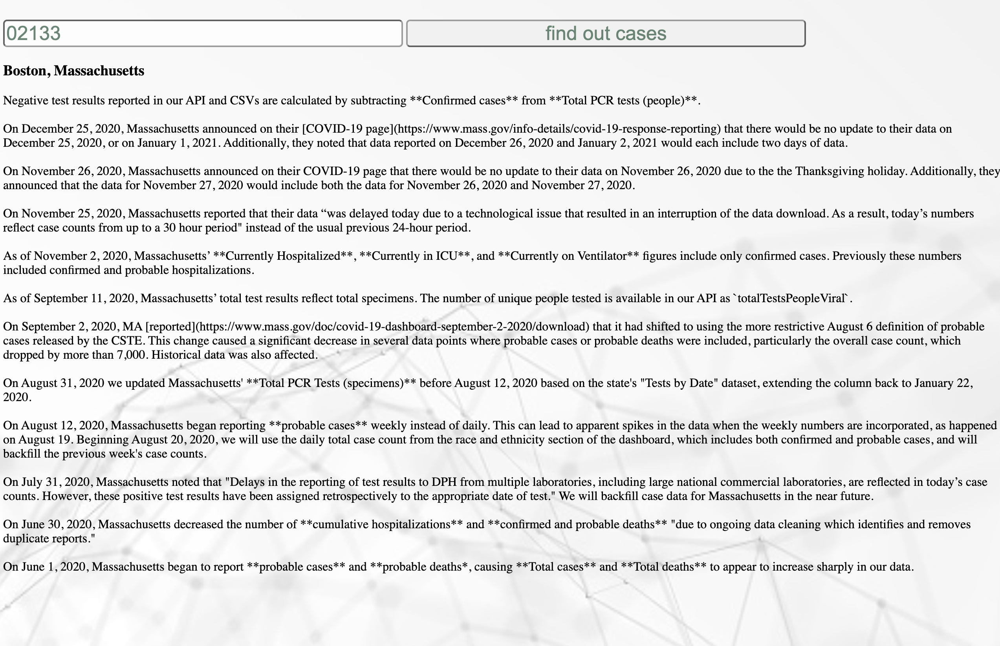

# 📊 Project: Complex API 
The website allows you to put your zipcode and it will populate which city you are then populate the current covid cases data collecting process in your city.

I completed the challenge: 5
I feel good about my code: 4

